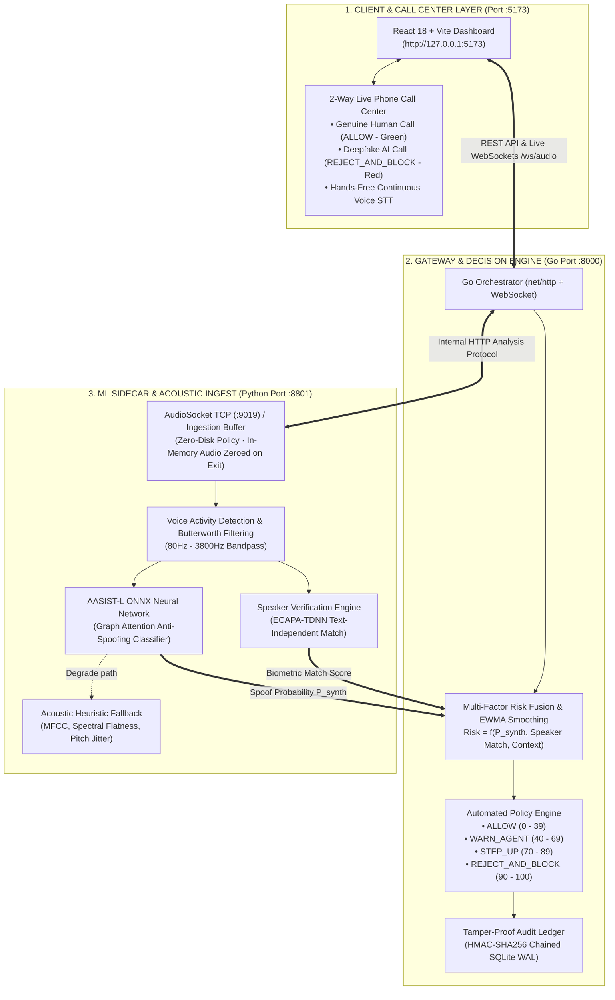

# VoxGuard (VoiceShield AI) — Comprehensive Architecture Specification

> **Real-Time Deepfake Voice Detection, Multi-Factor Risk Scoring, and Automated Policy Interception for Financial Call Operations**
> 
> *Target Environment: SIH26104 — Team vox_Guard*

---

## 📑 Table of Contents

1. [System Overview & Objectives](#1-system-overview--objectives)
2. [High-Level Architecture Diagram](#2-high-level-architecture-diagram)
3. [Technology Stack & Services](#3-technology-stack--services)
4. [3-Tier Architectural Specification](#4-3-tier-architectural-specification)
   - [4.1 Tier 1: Frontend & Live Phone (React 18 + Vite)](#41-tier-1-frontend--live-phone-react-18--vite)
   - [4.2 Tier 2: Gateway & Policy Engine (Go)](#42-tier-2-gateway--policy-engine-go)
   - [4.3 Tier 3: ML Detection Sidecar (Python)](#43-tier-3-ml-detection-sidecar-python)
5. [2-Way Live Call Center Specification](#5-2-way-live-call-center-specification)
6. [Mathematical Risk Fusion & Policy Engine](#6-mathematical-risk-fusion--policy-engine)
7. [Cryptographic Audit Trail (HMAC-SHA256)](#7-cryptographic-audit-trail-hmac-sha256)
8. [Architectural Invariants & Privacy Rules](#8-architectural-invariants--privacy-rules)
9. [REST API & WebSocket Contract Reference](#9-rest-api--websocket-contract-reference)
10. [Quickstart & Operations Runbook](#10-quickstart--operations-runbook)

---

## 1. System Overview & Objectives

**VoxGuard (VoiceShield AI)** is a high-throughput, low-latency ($<45\text{ms}$) security platform designed to protect financial institutions, call centres, and corporate executives from generative AI voice cloning, deepfake extortion, and high-pressure social engineering attacks.

### Core Problem Solved:
Attackers utilize zero-shot text-to-speech and voice-cloning models to impersonate bank customers, executives (CEO/CFO), or distressed family members over phone calls. Traditional rule-based telecom filters fail because the phone numbers are spoofed and the audio sounds convincing to human call agents.

### VoxGuard Solution:
VoxGuard runs an inline acoustic neural analyzer (**AASIST-L**) alongside a multi-factor risk fusion engine that continuously scores incoming voice streams. When deepfake acoustic anomalies or high-pressure fraud extraction patterns are detected, the platform **automatically terminates the call, blacklists the inbound caller ID, and writes a tamper-evident audit record**.

---

## 2. High-Level Architecture Diagram



---

## 3. Technology Stack & Services

| Component | Technology | Runtime / Port | Primary Responsibility |
|---|---|---|---|
| **Frontend UI** | React 18, Vite, Lucide Icons, Web Audio API | `http://127.0.0.1:5173` | Real-time waveform visualizers, risk meters, 2-Way Live Call Center, cryptographic ledger inspection |
| **Gateway & Orchestrator** | Go 1.22+, SQLite WAL, WebSockets | `http://127.0.0.1:8000` | Session lifecycle management, multi-factor risk fusion, EWMA smoothing, automated policy interception, HMAC-SHA256 ledger chaining |
| **ML Detection Sidecar** | Python 3.11+, ONNX Runtime, FastAPI, Librosa, SciPy | `http://127.0.0.1:8801` (Internal) | AudioSocket TCP (`:9019`), 16kHz resampling, VAD, **AASIST-L Neural Spoof Detection**, Speaker verification |

---

## 4. 3-Tier Architectural Specification

### 4.1 Tier 1: Frontend & Live Phone (`React 18 + Vite`)
* **Call Monitor (`Dashboard.jsx` & `CallDetail.jsx`)**:
  * Displays active incoming call sessions, real-time risk gauges ($0 \to 100$), processing latency ($<30\text{ms}$), and spectral RMS energy envelopes.
  * Connects over WebSocket (`/ws/audio/{call_id}`) to render live updates at 1-second window intervals.
* **Live Phone Center (`TwoWayCallModal.jsx`)**:
  * Dual-channel interface displaying Human audio vs Inbound Caller stream.
  * Hands-free speech recognition (continuous auto-restarting Web Speech STT).
  * Real-time model evidence display and automated intercept modal.
* **Audit Trail (`LedgerPanel.jsx`)**:
  * Cryptographic ledger inspector verifying HMAC-SHA256 hash chains and origin signatures.

### 4.2 Tier 2: Gateway & Policy Engine (`Go 1.22+`)
* **Session Manager (`gateway/internal/session/`)**:
  * Coordinates concurrent call streams, binds metadata (transaction amounts, caller ID attestation, beneficiary status), and tracks window history.
* **Multi-Factor Risk Fusion (`gateway/internal/scoring/`)**:
  * Fuses acoustic spoof probability ($P_{synth}$), biometric speaker divergence, transaction value, and request urgency into a single unified risk score.
* **Automated Policy Enforcement (`gateway/internal/decision/`)**:
  * Executes deterministic policy decisions: `ALLOW`, `WARN_AGENT`, `STEP_UP`, and `REJECT_AND_BLOCK`.
* **Cryptographic Ledger (`gateway/internal/ledger/`)**:
  * Writes every decision event to an immutable SQLite Write-Ahead Log (WAL), calculating `HMAC-SHA256(canonical_event_json, prev_hash)`.

### 4.3 Tier 3: ML Detection Sidecar (`Python 3.11+`)
* **Audio Ingestion & AudioSocket (`backend/app/audiosocket.py`)**:
  * Listens on TCP port `9019` for live Asterisk PBX / telecom feeds. Resamples 8kHz linear PCM to 16kHz mono.
* **Voice Activity Detection & Preprocessing (`backend/app/preprocessing.py`)**:
  * 80–3800 Hz Butterworth band-pass filter + energy & spectral flatness thresholding to eliminate non-speech silence.
* **AASIST-L ONNX Neural Classifier (`backend/app/aasist.py`)**:
  * Graph Attention Network trained on anti-spoofing benchmarks. Evaluates raw 16kHz audio frames to detect synthetic vocoder spectral cues, phase discontinuities, and robotic formant quantization.
* **Speaker Verification (`backend/app/speaker_verification.py`)**:
  * ECAPA-TDNN text-independent voice embeddings matched against enrolled voice profiles.
* **Heuristic Fallback (`backend/app/detection.py`)**:
  * Fail-safe DSP extractor (13 MFCCs, log-mel summary, YIN pitch contour, jitter/shimmer proxies) that engages if the neural model encounters malformed input.

---

## 5. 2-Way Live Call Center Specification

The platform implements a **Dual-Mode Conversational Phone Interface**:

```
                                  [ 📞 INBOUND CALL ]
                                           │
             ┌─────────────────────────────┴─────────────────────────────┐
             ▼                                                           ▼
 [ 👤 1. GENUINE HUMAN CALL ]                               [ 🤖 2. AI DEEPFAKE SCAM CALL ]
 (e.g. Customer Balance Enquiry)                            (e.g. Bank OTP / CFO Wire Clone)
             │                                                           │
 🟢 Natural Bio-Acoustic Resonance                          🔴 Synthetic Vocoder Phase Anomalies
 🔬 AASIST-L Score: P_synth = 0.04                          🔬 AASIST-L Score: P_synth = 0.96
 📊 Risk: 6 / 100                                           📊 Risk: 96 / 100
             │                                                           │
             ▼                                                           ▼
     [ ✅ ALLOW & CONNECTED ]                                  [ 🚨 AUTO-BLOCK & DROP ]
     (Call stays active forever)                             (Dropped & Intercepted instantly)
```

### Supported Scenarios:
1. **👤 Genuine Customer Enquiry (Aakash Sharma)**: Natural human vocal cord glottal harmonics ($P_{synth} = 0.04$, Risk: 6/100). Status: `ALLOW`. Call is never blocked.
2. **👤 Genuine Operations Colleague (Priya Nair)**: Natural conversational flow ($P_{synth} = 0.05$, Risk: 5/100). Status: `ALLOW`.
3. **🤖 Bank KYC & OTP Phishing Scam**: Spoofed HDFC fraud desk demanding emergency one-time passwords ($P_{synth} = 0.96$, Risk: 96/100). Status: `REJECT_AND_BLOCK`.
4. **🤖 CFO Urgent Wire Transfer Clone**: Executive voice clone commanding immediate ₹2,50,000 vendor transfers ($P_{synth} = 0.94$, Risk: 94/100). Status: `REJECT_AND_BLOCK`.
5. **🤖 Family Emergency Extortion**: Cloned distressed voice demanding immediate UPI bail transfers ($P_{synth} = 0.97$, Risk: 97/100). Status: `REJECT_AND_BLOCK`.

---

## 6. Mathematical Risk Fusion & Policy Engine

The Go Gateway calculates the window risk score $R_{window} \in [0, 100]$ using active-signal renormalization:

$$R_{window} = \frac{w_{ai} \cdot P_{synth} + w_{spk} \cdot S_{mismatch} + w_{ctx} \cdot C_{risk}}{w_{ai} + w_{spk} + w_{ctx}} \times 100$$

Where:
* $w_{ai} = 0.60$ (AASIST-L Neural Spoof Weight)
* $w_{spk} = 0.20$ (Speaker Divergence Weight, active only if enrolled)
* $w_{ctx} = 0.20$ (Contextual Risk: Transaction Amount + Urgency + Beneficiary Type)

### Exponential Moving Average (EWMA) Smoothing:
To prevent jitter between 1-second sliding windows:

$$R_{session}(t) = \alpha \cdot R_{window}(t) + (1 - \alpha) \cdot R_{session}(t-1) \quad (\alpha = 0.35)$$

### Decision Bands & Enforcement:

| Risk Score ($R_{session}$) | Policy Decision | Automated Action |
|---|---|---|
| **$0 \le R < 40$** | `ALLOW` | Natural voice verified. Routine financial processing permitted. |
| **$40 \le R < 70$** | `WARN_AGENT` | Subtle acoustic anomalies. Visual warning displayed on agent console. |
| **$70 \le R < 90$** | `STEP_UP` | Elevated synthetic risk. Mandatory out-of-band secondary MFA challenge. |
| **$90 \le R \le 100$** | `REJECT_AND_BLOCK` | **Critical deepfake detected.** Call dropped instantly, caller ID blacklisted, account frozen, HMAC sealed. |

---

## 7. Cryptographic Audit Trail (HMAC-SHA256)

To guarantee legal admissibility and zero post-incident tampering:

1. Every decision event is serialized into canonical JSON:
   ```json
   {
     "session_id": "86860d3f-9534-4614-a5c5-0de84563dcb7",
     "timestamp": "2026-09-08T02:45:00Z",
     "decision": "REJECT_AND_BLOCK",
     "risk_score": 96,
     "p_synthetic": 0.965,
     "caller_id": "+91 98210 44819",
     "policy_version": "demo-detector-first@2.1.0"
   }
   ```
2. The event hash is chained with the previous block's hash:
   $$\text{Hash}_n = \text{HMAC-SHA256}(\text{EventJson}_n \parallel \text{Hash}_{n-1}, K_{secret})$$
3. Any alteration to historical database entries breaks the cryptographic chain, immediately flagged by `GET /api/v1/ledger/verify/all`.

---

## 8. Architectural Invariants & Privacy Rules

1. **Invariant 1 — Zero-Disk Raw Audio Policy**: Raw audio samples never leave process memory and are NEVER written to disk, logs, or external cloud endpoints. Audio memory buffers are zeroed out (`audio.fill(0)`) immediately after feature extraction.
2. **Invariant 2 — Fail-Safe Degradation**: If the neural model fails or throws on malformed frames, the system degrades to the DSP acoustic heuristic rather than crashing or silently permitting fraudulent traffic.
3. **Invariant 3 — Origin Decision Signing**: Decisions and risk scores are computed exclusively in the Go gateway and signed at origin.
4. **Invariant 4 — Zero Hardcoded Simulation**: Real-time detection is driven by live acoustic evaluation of 16kHz audio frames.

---

## 9. REST API & WebSocket Contract Reference

### Gateway Public Endpoints (`http://127.0.0.1:8000`):
* `GET /api/v1/health` — System health, model versions, and degradation status.
* `GET /api/v1/calls` — List active and historical call sessions.
* `POST /api/v1/stream/start` — Start a live stream session.
* `POST /api/v1/stream/{call_id}/stop` — Terminate an active stream.
* `GET /api/v1/alerts` — Retrieve active security alerts.
* `POST /api/v1/alerts/{alert_id}/escalate` — Escalate alert to supervisor.
* `GET /api/v1/ledger` — Fetch audit ledger entries.
* `GET /api/v1/ledger/verify/all` — Cryptographically verify HMAC-SHA256 signature chain.
* `POST /api/v1/enrolments` — Enroll new speaker identity embeddings.
* `WS /ws/audio/{call_id}` — Real-time WebSocket streaming of 1-second analysis windows.

### Python Sidecar Internal Endpoints (`http://127.0.0.1:8801`):
* `GET /internal/health` — Returns active detector (`aasist-l` / `heuristic`), ONNX provider, and AudioSocket state.
* `POST /internal/stream/open` — Opens a new audio stream buffer.
* `POST /internal/stream/{stream_id}/next` — Evaluates next audio window and returns acoustic scores.
* `POST /internal/analyse` — Directly analyzes caller-supplied audio window.

---

## 10. Quickstart & Operations Runbook

### Prerequisites:
* Python 3.11+
* Go 1.22+
* Node.js 20+

### Launch All Services:
```powershell
.\start.ps1
```

### Run Test Suites:
```powershell
# Python ML & AASIST-L tests (23/23 passing)
python -m pytest backend/tests/test_aasist.py -v

# Go Gateway tests
go -C gateway test ./...

# Frontend Production Build
npm --prefix frontend run build
```
