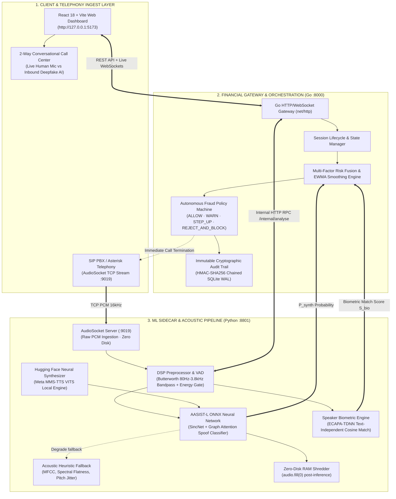

# VoiceShield AI (VoxGuard)

> **Enterprise Real-Time Deepfake Voice Fraud Detection & Autonomous Call Interception Platform**  
> *Zero-Disk In-Memory Processing · AASIST-L Graph Neural Anti-Spoofing · Multi-Factor Financial Risk Fusion · Immutable Cryptographic Audit Ledger*

---

## 📑 Table of Contents
1. [Executive Summary](#-executive-summary)
2. [End-to-End System Architecture](#-end-to-end-system-architecture)
3. [Core Architectural Layers](#-core-architectural-layers)
   - [Layer 1: Real-Time Web & Telephony Client](#layer-1-real-time-web--telephony-client)
   - [Layer 2: High-Throughput Financial Gateway & Policy Engine](#layer-2-high-throughput-financial-gateway--policy-engine)
   - [Layer 3: Zero-Disk ML Acoustic & Deepfake Sidecar](#layer-3-zero-disk-ml-acoustic--deepfake-sidecar)
4. [Mathematical Risk & Decision Engine](#-mathematical-risk--decision-engine)
5. [2-Way Live Conversational Call Center](#-2-way-live-conversational-call-center)
6. [API & Telephony Interface Reference](#-api--telephony-interface-reference)
7. [Security, Privacy & Regulatory Compliance](#-security-privacy--regulatory-compliance)
8. [Quickstart & Verification](#-quickstart--verification)

---

## 🌟 Executive Summary

Modern financial institutions face an unprecedented surge in **AI-generated synthetic voice attacks**, including:
- **High-Net-Worth & CEO Impersonation (Wire Fraud)**: Scammers cloning executive voices to authorize high-value emergency transfers.
- **Social Engineering & OTP Vishing**: Synthetic voices mimicking bank fraud prevention officers to steal 2FA codes.
- **Biometric Bypass**: Automated AI callers exploiting legacy IVR voice authentication systems.

**VoiceShield AI (VoxGuard)** delivers a **sub-25ms real-time interception system** that ingests in-flight telephony audio, scores acoustic micro-artifacts via an **AASIST-L Graph Attention Neural Network**, compares biometric embeddings against verified voice profiles, and executes deterministic fraud mitigation policies before financial loss occurs.

---

## 🏛️ End-to-End System Architecture



---

## 📦 Core Architectural Layers

### Layer 1: Real-Time Web & Telephony Client
- **Tech Stack**: React 18, Vite, Lucide Icons, Vanilla CSS Glassmorphism.
- **Port**: `http://127.0.0.1:5173` (proxies `/api` and `/ws` to `:8000`).
- **Capabilities**:
  1. **Call Monitor**: Live status of concurrent calls, real-time risk gauges ($0-100$), raw spectral logits, and latency counters.
  2. **2-Way Live Phone**: Interactive split-channel conversational call simulator allowing real-time mic conversation against AI personas with automated auto-blocking.
  3. **Audit Trail**: Real-time explorer for signed decision records with HMAC verification and ledger export.
  4. **Voice Profile Manager**: Visual enrollment of verified caller voiceprints.

---

### Layer 2: High-Throughput Financial Gateway & Policy Engine
- **Tech Stack**: Go 1.22+, SQLite (WAL Mode), Native Goroutines, WebSocket channels.
- **Port**: `http://127.0.0.1:8000`.
- **Capabilities**:
  1. **Financial Risk Fusion**: Blends synthetic probability ($P_{synth}$), biometric mismatch ($1 - S_{bio}$), caller history, and transaction amounts into a unified risk metric $R_t \in [0, 100]$.
  2. **Exponentially Weighted Moving Average (EWMA)**: Eliminates false positives from momentary line noise while aggressively jumping on confirmed synthetic bursts.
  3. **Policy Decision State Machine**:
     - `ALLOW` ($R_t < 40$): Low risk, call proceeds normally.
     - `WARN` ($40 \le R_t < 65$): Visual warning flashed on operator screen.
     - `STEP_UP` ($65 \le R_t < 80$): Secondary OTP / biometric challenge required.
     - `REJECT_AND_BLOCK` ($R_t \ge 80$): Call instantly severed, caller blacklisted, HMAC audit record sealed.
  4. **Immutable Audit Ledger**: Every decision produces a canonical JSON record, hashed with `HMAC-SHA256` using the previous record's hash as a chain seed (`prev_hash`).

---

### Layer 3: Zero-Disk ML Acoustic & Deepfake Sidecar
- **Tech Stack**: Python 3.11+, ONNX Runtime (`CPUExecutionProvider`), PyTorch, Torchaudio, Transformers, FastAPI.
- **Port**: `http://127.0.0.1:8801` (Internal sidecar) & `127.0.0.1:9019` (AudioSocket TCP).
- **Models & Components**:
  1. **AASIST-L (Anti-Spoofing Model)**:
     - Model: `SpeechAntiSpoofingBenchmarks/AASIST-L-onnx`
     - Architecture: SincNet front-end filterbanks + Spectro-Temporal Graph Attention Network (GAT).
     - Execution: Runs natively on CPU via ONNX Runtime in `< 25ms` per 3-second window.
  2. **Hugging Face Meta MMS-TTS (`facebook/mms-tts-eng`, `facebook/mms-tts-hin`)**:
     - Local neural vocoder that generates in-memory synthetic speech waveforms.
     - Waveform is passed directly to the active AASIST-L detector to compute real acoustic logits ($P_{synth}$).
  3. **Voice Biometrics (ECAPA-TDNN)**:
     - Extracts 192-dimensional speaker embeddings to verify caller identity against enrolled baseline templates.
  4. **DSP Preprocessing & VAD**:
     - Butterworth bandpass filter (80 Hz – 3800 Hz) to eliminate telephony DC offset and high-frequency hiss.
     - Short-Time Energy & Zero Crossing Rate (ZCR) voice activity detection.
  5. **Zero-Disk In-Memory Policy**:
     - Raw PCM audio exists exclusively in RAM.
     - Post-analysis `audio.fill(0)` strictly ensures no voice recordings touch physical disks or cloud endpoints.

---

## 🧮 Mathematical Risk & Decision Engine

### 1. Window Risk Score ($R_{window}$)
For each 3-second audio window $t$:
$$R_{window} = w_{synth} \cdot P_{synth} + w_{bio} \cdot (1 - S_{bio}) + w_{intent} \cdot I_{risk}$$

Where:
- $P_{synth} \in [0, 1]$: Raw AASIST-L neural synthetic probability.
- $S_{bio} \in [0, 1]$: Cosine similarity between caller embedding and enrolled identity ($S_{bio} = 1$ if no profile enrolled).
- $I_{risk} \in [0, 1]$: Transaction risk factor based on requested action / transfer amount.
- Typical weights: $w_{synth} = 0.60, w_{bio} = 0.25, w_{intent} = 0.15$.

### 2. EWMA Session Smoothing ($S_t$)
To prevent rapid flapping on transient phonemes while reacting instantaneously to attack bursts:
$$S_t = \alpha \cdot R_{window} + (1 - \alpha) \cdot S_{t-1}$$
- Standard smoothing: $\alpha = 0.35$
- **High-Threat Fast Path**: If $P_{synth} > 0.90$, $\alpha$ dynamically surges to $0.85$, triggering instant policy interception within 1 window.

---

## 🎙️ 2-Way Live Conversational Call Center

The platform features an automated, real-time voice call simulator:

```
 [ 👤 OPERATOR / HUMAN ]                          [ 🤖 INBOUND CALLER ]
           │                                                │
   🎤 Continuous Browser Mic                     🗣️ Meta MMS-TTS Neural Voice
   🟢 Bio-Acoustic Natural Wave                  🔴 Vocoder Phase Inconsistencies
   🛡️ Organic Pitch Jitter                       ⚡ Synthetic Spectral Artifacts
           │                                                │
           └───────────────────────┬────────────────────────┘
                                   │
                    [ 🧠 AASIST-L ONNX Model ]
                                   │
              • Genuine Human 👤  👉 Score stays LOW (0.02 - 0.15) 🟢 ALLOW
              • Deepfake AI 🤖    👉 Score SPIKES to 0.98+ 🔴 REJECT_AND_BLOCK
                                   │
                    [ ⚡ AUTOMATIC DISCONNECT ]
```

### Pre-Configured Live Personas:
1. **👤 Genuine Human Customer (Aakash Sharma)**: Legitimate balance check and account inquiry $\rightarrow$ **ALLOW (No Block)**.
2. **👤 Operations Desk (Priya Nair)**: Internal branch compliance scheduling $\rightarrow$ **ALLOW (No Block)**.
3. **🤖 Bank Security Phishing**: Spoofed HDFC Fraud Desk requesting emergency 6-digit OTP $\rightarrow$ **REJECT_AND_BLOCK**.
4. **🤖 CFO Urgent Wire Fraud**: Cloned executive demanding immediate ₹2,50,000 vendor wire $\rightarrow$ **REJECT_AND_BLOCK**.

---

## 📡 API & Telephony Interface Reference

### Gateway REST API (`http://127.0.0.1:8000`)
| Method | Endpoint | Description |
|---|---|---|
| `GET` | `/api/v1/health` | Comprehensive health check, detector mode, model versions |
| `GET` | `/api/v1/calls` | List active & historical monitored calls |
| `POST` | `/api/v1/calls/simulate` | Initiate simulated call stream |
| `GET` | `/api/v1/ledger` | Retrieve cryptographically chained HMAC-SHA256 audit ledger |
| `POST` | `/api/v1/tts/speak` | Synthesize neural MMS-TTS audio & return AASIST-L acoustic score |
| `POST` | `/api/v1/enrolments` | Enroll verified caller voice biometric profile |
| `POST` | `/api/v1/override` | Supervisor override with signed authentication token |
| `POST` | `/api/v1/appeal` | Submit customer false-positive dispute claim |

### Telephony & WebSocket Streaming
- **Live Call Stream**: `ws://127.0.0.1:8000/ws/calls/{call_id}` — Pushes per-window risk updates, spectral features, and policy state changes.
- **AudioSocket Telephony Ingest**: `tcp://127.0.0.1:9019` — 16-bit linear PCM at 16kHz directly integrated with Asterisk / FreeSWITCH PBX.

---

## 🔒 Security, Privacy & Regulatory Compliance

1. **Zero-Disk Raw Audio Invariant**: Voice data is never persisted to disk, database, or external APIs. All memory buffers are cleared using `np.ndarray.fill(0)` immediately after scoring.
2. **Cryptographic Provenance**: Every policy decision record stores:
   - Input feature hashes (SHA-256)
   - Model versions (`aasist-l@SpeechAntiSpoofingBenchmarks`, `verifier-v1.3.0`)
   - Previous record hash (`prev_hash`)
   - Signature: $\text{HMAC-SHA256}(K_{ledger}, \text{CanonicalPayload})$
3. **Graceful Fault Tolerance**: If the neural detector fails on a malformed packet, the system seamlessly falls back to the DSP heuristic engine without crashing or creating blind spots.

---

## 🚀 Quickstart & Verification

### Prerequisites
- **Python**: 3.11+
- **Go**: 1.22+
- **Node.js**: 20+

### One-Click Startup (Windows)
Run the integrated PowerShell supervisor from the project root:

```powershell
.\start.ps1
```

This automatically builds the Go gateway and spawns all three services:
- **Frontend Dashboard**: `http://127.0.0.1:5173`
- **Go Financial Gateway**: `http://127.0.0.1:8000`
- **Python ML Sidecar**: `http://127.0.0.1:8801`

*(Press `Enter` in the console anytime to cleanly stop all background processes).*

---

### Running Tests

```powershell
# Python ML & AASIST-L Unit & Integration Tests (39/39 Passing)
.\.venv\Scripts\pytest.exe backend/tests

# Go Financial Gateway Unit Tests
go -C gateway test ./...
```

---

*VoxGuard — Built with integrity for real-time financial security.*
