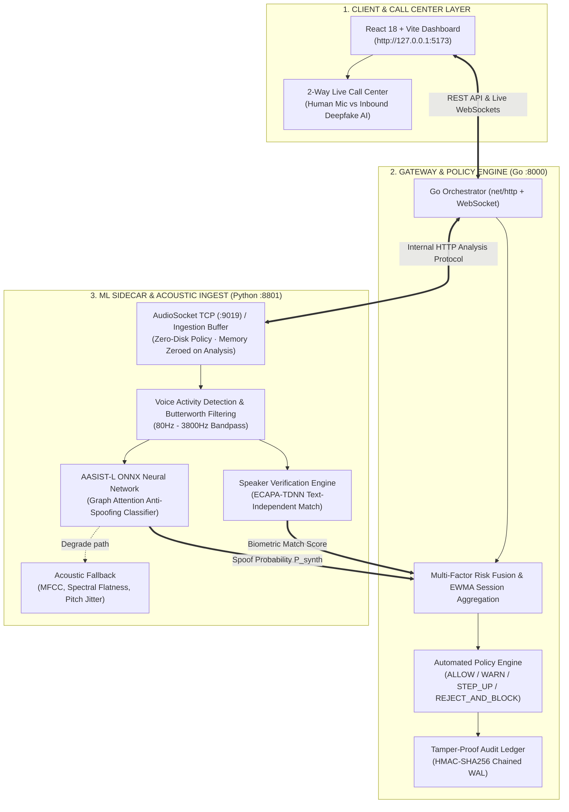

# VoiceShield AI (VoxGuard)

> **Real-Time Deepfake Voice Detection & Automated Fraud Interception for Financial Call Operations**
> 
> *SIH26104 — Team vox_Guard*

---

## 🏛️ System Architecture



---

## 📦 3-Tier Layer Breakdown

| Layer | Technology | Port / Protocol | Responsibilities |
|---|---|---|---|
| **Frontend UI** | React 18, Vite, Lucide Icons | `http://127.0.0.1:5173` | Real-time waveform visualizers, risk meters, **2-Way Live Phone**, audit inspection, appeal handling |
| **Gateway & Policy Engine** | Go 1.22+, SQLite WAL, WebSockets | `http://127.0.0.1:8000` | Session lifecycle, multi-factor risk fusion, EWMA smoothing, **Automated Interception Policy**, HMAC-SHA256 audit chaining |
| **ML Detection Sidecar** | Python 3.11+, ONNX Runtime, FastAPI | `http://127.0.0.1:8801` (Internal) | AudioSocket TCP (`:9019`), 16kHz resampling, VAD, **AASIST-L Neural Spoof Detection**, Speaker verification |

---

## 🔒 Architectural Invariants

1. **Zero-Disk Raw Audio Policy**: Raw audio samples never touch physical disk or cloud storage. Audio buffers are processed strictly in RAM and zeroed out (`audio.fill(0)`) immediately after feature extraction.
2. **Deterministic Fallback**: If the AASIST-L ONNX model is unavailable or throws on a corrupt audio frame, the pipeline seamlessly degrades to the DSP acoustic heuristic rather than crashing or silently passing fraudulent audio.
3. **Cryptographic Auditability**: Every call decision (ALLOW, WARN, STEP_UP, REJECT_AND_BLOCK) is signed with HMAC-SHA256 and chained in an immutable SQLite Write-Ahead Log.

---

## 🎙️ 2-Way Live Phone: Human vs Deepfake AI

The platform includes an interactive, automated 2-Way Live Phone Call interface:

```
 [ 👤 HUMAN (You / Agent) ]                 [ 🤖 INBOUND CALLER (Deepfake AI) ]
        │                                                     │
   🎤 Real Mic (Speech-to-Text)                         🗣️ Synthetic AI Voice
   🟢 Bio-Acoustic Natural Wave                         🔴 Glitched Spectral Artifacts
   🛡️ Genuine Harmonics                                ⚡ High-Frequency Vocoder Cues
        │                                                     │
        └──────────────────────────┬──────────────────────────┘
                                   │
                    [ 🧠 AASIST-L Neural Detector ]
                                   │
              • Human speaks   👉 Risk stays LOW (0-15%)
              • Deepfake speaks👉 Risk SPIKES to 96/100
                                   │
                   [ 🚨 AUTOMATED POLICY ENGINE ]
                                   │
             ⚡ Drop Call + Blacklist + HMAC-SHA256 Sealed
```

### Supported Scenarios:
1. **Bank KYC & OTP Phishing**: Spoofed banking desk demanding emergency one-time passwords.
2. **CFO Urgent Wire Transfer**: Executive voice clone commanding instant high-value vendor transfers.
3. **Family Emergency Extortion**: Cloned distressed voice demanding immediate UPI bail transfers.

---

## 🚀 Quickstart (Windows)

### Prerequisites:
- Python 3.11+
- Go 1.22+
- Node.js 20+

### One-Click Launch:
Run the integrated PowerShell supervisor from the root directory:

```powershell
.\start.ps1
```

This starts all three services simultaneously:
- **Dashboard**: `http://127.0.0.1:5173`
- **Go Gateway**: `http://127.0.0.1:8000`
- **Python ML Sidecar**: `http://127.0.0.1:8801`

*(Press `Enter` in the console window to cleanly stop all background services).*

---

### Manual Multi-Terminal Startup:

**Terminal 1 — Python ML Sidecar**:
```powershell
.\.venv\Scripts\python.exe -m app.sidecar
```

**Terminal 2 — Go Gateway**:
```powershell
go -C gateway run ./cmd/voxguard
```

**Terminal 3 — React Dashboard**:
```powershell
cd frontend
npm run dev
```

---

## 🧪 Test & Verification

Run backend unit & integration tests:

```powershell
# Python ML & AASIST-L tests (39/39 passing)
.\.venv\Scripts\pytest.exe backend/tests

# Go Gateway tests
go -C gateway test ./...

# Frontend Production Build
npm --prefix frontend run build
```

---

## 📊 Automated Decision Bands

| Risk Score | Policy Action | Description |
|---|---|---|
| **0 – 39** | `ALLOW` | Natural human bio-harmonics verified. Normal transaction allowed. |
| **40 – 69** | `WARN_AGENT` | Subtle anomalies detected. Visual advisory displayed to agent. |
| **70 – 89** | `STEP_UP` | Elevated synthetic risk. Mandatory out-of-band secondary verification. |
| **90 – 100** | `REJECT_AND_BLOCK` | **Critical deepfake detected.** Call dropped instantly, caller ID blacklisted, HMAC-SHA256 audit record generated. |
